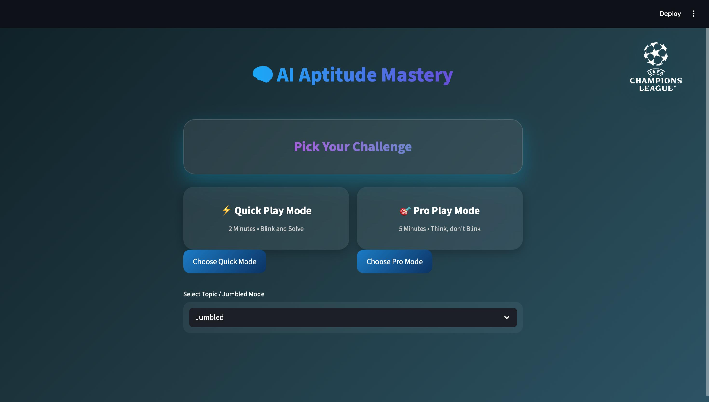
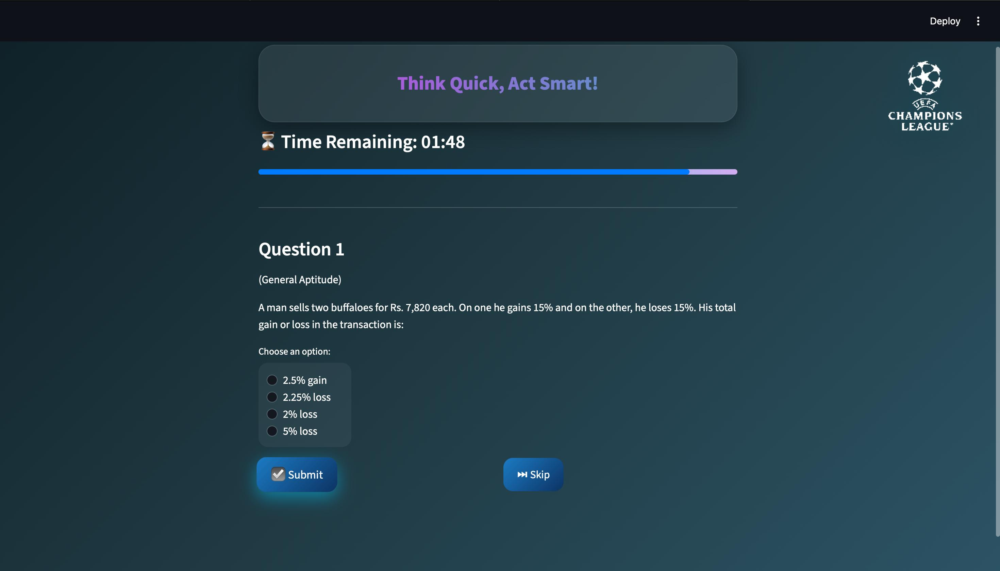
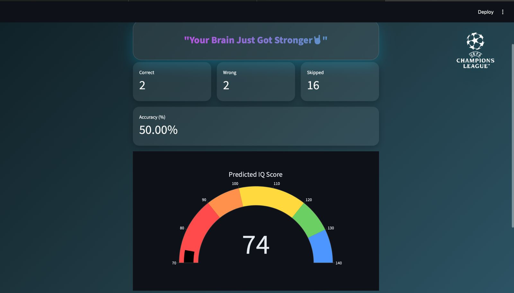

<h1 align="center">🧠 AI Aptitude Mastery</h1>

<p align="center">
An AI-powered interactive quiz platform that evaluates logical ability, technical knowledge, and aptitude skills — and predicts an estimated IQ score based on user performance.
<br><br>
Built with <b>Python</b> and <b>Streamlit</b>, featuring dynamic question generation and performance analytics.
</p>

---

## 🚀 Project Overview

**AI Aptitude Mastery** is a smart quiz platform where users:

- Select a quiz mode (Quick or Pro)
- Choose a topic (Technical, Aptitude, Logical, or Jumbled)
- Solve time-bound questions
- Receive performance analytics
- Get an AI-based IQ estimation

The system uses structured datasets and dynamic question variation logic.  
Future updates will include AI-generated adaptive questions and intelligent IQ prediction models.

---

## 🎯 Current Features

### 🧩 Quiz System
- Multiple categories:
  - CSE / Technical
  - General Aptitude
  - Logical Reasoning
  - Jumbled (Mixed Mode)
- 20 randomized questions per session
- AI-augmented question variations
- Skip option
- Timer-based quiz system

### ⚡ Modes
- **Quick Mode** → 2 Minutes (Fast challenge)
- **Pro Mode** → 5 Minutes (Deep thinking)

### 📊 Performance Analytics
- Correct Answers
- Wrong Answers
- Skipped Questions
- Accuracy Percentage
- Estimated IQ Score
- Visual IQ Speedometer Gauge (Plotly)

### 🎨 UI/UX
- Glassmorphism design
- Gradient animated headers
- Hover effects
- Dynamic progress bar
- Responsive layout

---

## 🧠 IQ Estimation Logic (Current Version)

The current IQ score is calculated using:

- Number of correct answers
- Number of wrong answers
- Time consumed
- Attempted vs skipped questions

IQ score is normalized between **70 – 140**.

> ⚠️ This is a performance-based estimation and not a clinically validated IQ test.

---

## 📸 Demo Screenshots

### 🏁 Challenge Setup
<p align="center">
  
</p>

### 🧠 Live Quiz Arena
<p align="center">
  
</p>

### 📊 Performance Dashboard
<p align="center">
  
</p>

---

## 🏗️ Project Structure (Current + Planned)

```bash
AI_Aptitude_Master/
│
├── app.py                        # Main Streamlit application
├── style.css                     # Custom glassmorphism UI styling
├── requirements.txt              # Project dependencies
├── README.md                     # Project documentation
│
├── assets/
│   └── logo.png                  # Application logo
│
├── data/
│   ├── cse_dataset.csv                       # Technical questions dataset
│   ├── clean_general_aptitude_dataset.csv    # General aptitude dataset
│   └── logical_reasoning_questions.csv       # Logical reasoning dataset
│
├── models/                       # (Future) Trained ML models
│   ├── iq_prediction_model.pkl
│   ├── question_generation_model.pkl
│   └── difficulty_classifier.pkl
│
├── notebooks/                    # (Future) Model training notebooks
│   ├── iq_model_training.ipynb
│   ├── question_generation_training.ipynb
│   └── difficulty_model_training.ipynb
│
└── utils/                        # (Optional future modularization)
    ├── quiz_engine.py
    ├── ai_generator.py
    ├── scoring.py
    └── data_loader.py

```
---

## 🛠️ Tech Stack

**Language:** Python  
**Framework:** Streamlit  
**Data Handling:** Pandas  
**Visualization:** Plotly  
**State Management:** Streamlit Session State  
**Styling:** Custom CSS (Glassmorphism UI)  

---

## ⚙️ Installation & Setup

### 1️⃣ Clone Repository

```bash
git clone https://github.com/dataqubit404/AI-Powered-Aptitude-Mastery.git
cd AI-Powered-Aptitude-Mastery.git
```

### 2️⃣ Create Virtual Environment

#### 🪟 Windows
```bash
python -m venv venv
venv\Scripts\activate
```

#### 🍎 macOS / 🐧 Linux
```bash
python3 -m venv venv
source venv/bin/activate
```

### 3️⃣ Install Dependencies

```bash
pip install -r requirements.txt
```


### 4️⃣ Run the Application

```bash
streamlit run app.py
```


### Open your browser and visit:

```bash
http://localhost:8501
```


# 🔮 Upcoming AI Enhancements

This project is evolving into a fully AI-driven adaptive assessment system.

---

## 🤖 1. AI Question Generator (Planned)

- Train a model to generate questions dynamically  
- Difficulty levels:
  - Easy  
  - Medium  
  - Hard  
- Context-aware question creation  
- Topic-based generation  

---

## 🔥 2. Rapid Fire Mode (Planned)

- Unlimited questions  
- Fixed time limit  
- Continuous difficulty scaling  
- Real-time streak tracking  
- Adaptive AI difficulty adjustment  

---

## 🧮 3. Advanced IQ Prediction Model (Planned)

A separate ML model will be trained using:

- Time per question  
- Accuracy ratio  
- Streak performance  
- Difficulty level  
- Response consistency  

**Goal:** Provide a more data-driven and statistically grounded IQ estimation.

---

# 📊 Future Improvements

- Leaderboard system  
- User authentication  
- Performance history tracking  
- Database integration  
- AI-based personalized feedback  
- Deployment on Streamlit Cloud  
- Docker containerization  
- Model explainability dashboard  

---

# ⚠️ Disclaimer

This platform is designed for:

- Educational purposes  
- Skill assessment  
- Practice and self-evaluation  

It is **not a certified IQ test** and should not be considered a psychological assessment tool.

---

# 📄 License

This project is licensed under the **MIT License**.

You are free to:

- Use  
- Modify  
- Distribute  
- Publish  

With proper attribution.

---

# 👨‍💻 Author

Developed by **Raj Darlami**

If you found this project useful, consider giving it a ⭐ on GitHub.
    
